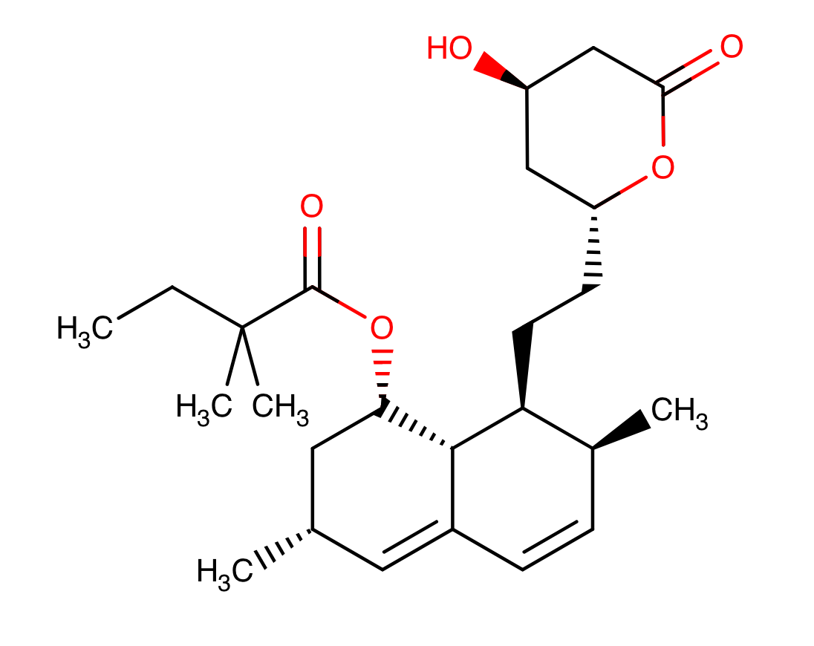

## Important Information

1. Due electronically by **5 PM PDT, Friday, November 20, 2020**. 
2. Programming projects must be completed individually. You may discuss algorithms with others, but the coding should be done alone. You must explicitly name everyone with whom you discussed this project in the header comments of your code and in the project 4 quiz you submit. Students must abide by the terms of the [Stanford Honor Code](http://studentaffairs.stanford.edu/communitystandards/policy/honor-code).
3. Remember to consult Piazza, as many common questions will be asked and answered there.
4. Prior to beginning the assignment please read the [Code Policy](https://canvas.stanford.edu/courses/122868/pages/code-policy).
5. Pay careful attention to instructions for naming and formatting output files. You will not receive full credit if you do not follow these instructions.
6. You will need to write additional code to answer some of the quiz questions. This code does not need to be submitted, and will not be graded. The code you submit should not perform these additional tasks. Source code must run **exactly** as specified below. We will be running your code on tests using python3.
7. **Integrated Design:** This project should be less challenging than projects 1-3, so we'll be looking for good code design decisions. The three tasks require many similar or identical functionalities. One way to achieve this is to copy/paste class and function definitions from one program to the next program. For the purposes of this class, this is suboptimal (Note: copy/pasting blocks of code ''within'' a program is never acceptable). Try to make each function appropriately modular and consider have a `chemoUtils.py` file that contains code used in the other programs, that way you can just import it rather than repeating code. 
8. **Stricter Code Style, Readability, and Documentation requirements**
   **In order to obtain full credit on the project, you must not only utilize modular code, but you also must use good style, readability, and documentation practices as outlined on the [Code Policy](https://canvas.stanford.edu/courses/122868/pages/code-policy).** By this point in the class everyone should be well aware of how to code in Python, and write quality documentation for classes, methods, functions, scripts,use of a main function etc.

 

------

 

## 1. Files to Download

The files needed for this assignment are contained within  subdirectories zipped into this file:

[Click here to download files.](https://canvas.stanford.edu/courses/122868/files/6438146/download?wrap=1)

 

------

## 2. Introduction

Throughout much of this course we have looked at biological data to better understand the functions of proteins and their relationships to biological phenotypes. In this project we will be looking at chemicals and chemical structure to gain insight into how chemical similarity of protein ligands relates to the similarity of the proteins themselves.

In some cases two proteins may be highly similar in both sequence and structure, and as a result they will bind at least some of the same ligands (e.g. chemicals or small messenger molecules). However, it is also possible that two receptors may appear to be extremely different by all bioinformatic measures and yet still bind the same ligands. Similarly, there exist highly similar receptors which do not bind any of the same ligands.

So rather than look at sequence or even structure to compare proteins we can look at the sets of ligands (chemicals) which bind their receptors. This approach was used by Keiser et al in their paper [Relating protein pharmacology by ligand chemistry](http://www.ncbi.nlm.nih.gov/pubmed/17287757). In this project, we will implement a similar method to compare proteins and their ligands, look at a few specific cases of protein similarity, and then build a network connecting the proteins by the similarity of their ligand sets.

 

------

## 3. Drugs, SMILES, Fingerprints, and Tanimoto comparisons

The [DrugBank](http://www.drugbank.ca/) database contains more than 4,000 records of small molecules, peptides, and approved and experimental drugs. Each drug in the database has its own entry which contains detailed information about the drugs, including mechanism of action, structure, function, and chemical representation. For example, the [entry for Simvastatin](https://www.drugbank.ca/drugs/DB00641), a medication for the treatment of high cholesterol, includes an image of the structure (below):

​                     

It also includes a SMILES (Simplified Molecular Input Line Entry System) code for the drug:

 ```CCC(C)(C)C(=O)OC1CC(C)C=C2C=CC(C)C(CCC3CC(O)CC(=O)O3)C12``` 

These SMILES codes are ASCII simplifications of the drugs which provide a 2D representation of the atoms and the bonds in the molecule. You can read more about SMILES at the [Daylight Chemical Information Systems](http://www.daylight.com/smiles/index.html) website. One of the advantages of these 2D ASCII representations is that they are very efficient for computation. Using the SMILES code we can compute a 2D fingerprint, which is a further simplification of the molecule into a set of ''keys'' indicating the presence of a feature in the molecule. To compute a fingerprint, chemoinformaticians have chosen different features of molecules that are represented by these keys. Examples of keys are:

- Are there fewer than 3 oxygens?
- Is there an S-S bond?
- Is there a ring of size 4?
- Is at least one F, Cl, Br, or I present?

We can then think about a fingerprint as a bitmap or a set where each value indicates whether or not the molecule contains that key. For example, the fingerprint for Simvastatin is:

26 50 57 66 74 76 83 89 91 96 99 104 108 112 114 115 116 123 126 127 128 129 132 136 137 139 140 141 143 146 147 149 150 152 154 155 157 159 160 164 165

So Simvastatin has features 26, 50, 57, ... and none of the features not listed above. You can read more about fingerprints at the [Daylight Chemical Information Systems](http://www.daylight.com/dayhtml/doc/theory/theory.finger.html) website. In this project we have provided you with a list of drugs and a list of targets for those drugs. Each drug is also listed with its fingerprint. In order to compare two chemicals we can use the Tanimoto Coefficient (also known as the Jaccard Index). For two molecules molA and molB we define the Tanimoto coefficient, Tc as:

 

Where fpt(molA) and fpt(molB) are the fingerprint sets for the two molecules A and B.

------

## 4. Ligand sets and similarity

We have already learned about using sequence alignments and scores (such as project 1 or BLAST) to compare two proteins. In this project we will be comparing two proteins by comparing the sets of ligands that bind their receptors. Using this approach we could compare two receptors A and B by comparing the pairwise chemical structure of the ligands that they bind. So if we have two molecules A and B and we know what ligands bind to them we can compute the Tc for each pair and look at the values. The [ Similarity Ensemble Approach](http://sea.bkslab.org/)(SEA) of Keiser et al computed a statistic (similar to BLAST) in order to determine the significance of these scores. For this project, we will use a simplified version.

Their statistic involves computing a similarity score by summing up all of the pairwise Tc values above a cutoff. If the Tc value is too low, then it mostly contributes noise to the data. For our project we will define the cutoff as 0.5. So, we define the Tsummary for two proteins A and B as:


In other words, compute all the pairwise Tanimoto similarities for the drugs that bind protein A and protein B, and sum the values that are greater than 0.5. So if A binds ligands a1, a2, a3 and B binds ligands b1 and b2 then we have to compare:

\* a1 -- b1

\* a1 -- b2

\* a2 -- b1

\* a2 -- b2

\* a3 -- b1

\* a3 -- b2

We then sum up all of the Tc values that are greater than 0.5. This number will depend upon the size of the ligand sets, so it can be difficult to compare these values for significance. We will generate a 'bootstrap p-value' in order to determine which Tsummary values are significant. We do this by choosing 500 random pairs of sets of ligands.

Sampling procedure:

- For b in sampling iterations:
  - Sample, with replacement, set of ligands of the same size as the ligand set for protein A
  - Sample, with replacement, set of ligands of the same size as the ligand set for protein B
  - Compute $T^b_{summary}$

This bootstrap sampling procedure will give us an empirical estimate of the probability of getting the value of Tsummary by selecting two proteins at random. We calculate a p-value for our protein pair, $p_{bootstrap }$, using the following formula:


where the numerator is the number of bootstrap iterations for which sampled Tbsummary is greater than or equal to the original Tsummary, and the denominator, N, is the total number of bootstrap iterations ('N' = 500 in the above example).

So if we are given given two proteins A and B, and we want to determine whether their ligand sets are significantly similar we will:

1. compute Tsummary(A,B) for the proteins using their actual ligand sets
2. let na = size(ligands(A)), nb = size(ligands(B))
3. For i in sampling iterations (note change of notation from b to i for examples):
   1. choose a set of na random ligand
   2. choose a set of nb random ligands
   3. compute Tisummary using these random ligand sets

4. compute pbootstrap using the equation above 

------

## 5. Generating and Visualizing Networks

 

**5.1 Description** 

In the last part of this project you will generate bootstrap p-values for a subset of drug target proteins. Look at the file protein_nodes.csv. For a subset of uniprot_accession IDs from targets.csv, it lists the usual indications for which the protein is targeted (cholesterol, bp, and/or diabetes).

Using the bootstrap p-values that you compute using the above method, you will create a network where the nodes are proteins and edges are drawn between pairs for which the bootstrap p-value is less than or equal to 0.05. You will do this by generating an edge list, then construct and plot the network using the 'networkx' python package, a popular network analysis package.

'**You should compute your bootstrap p-values using the entire set of drugs in drugs.csv for your random sets**'. However, you will only be generating the network nodes for the proteins in protein_nodes.csv.

(**Note:** if your multiple hypothesis correction alarms bells were going off, good intuition! There are many hypotheses in play here. For the purposes of this project, **do not** apply Bonferroni correction to adjust your p-values. In the real world, though, make sure you correct for multiple hypotheses.)

You will generate an edgelist file for networkx with the following format:

Two columns of "uniprot_accession" IDs, separated by a space, that represent a pair of protein nodes you've determined should have an edge between them based on your bootstrap p-values. The result will look like this:

```
P21918 P21728
P21728 P05184
P18089 P18825
P18089 P08913
P18089 P08588
P18089 P07550
...
```

**5.2 NetworkX Installation and useful functions
**

Download and install the networkx package. You can do this using [pip](https://pypi.org/project/pip/)which is likely already installed on your machine, and the command below:

  ```pip install networkx ```

Additionally, you'll want to familiarize yourself with the following networkx functions:

[read_edgelist](https://networkx.github.io/documentation/networkx-1.9/reference/generated/networkx.readwrite.edgelist.read_edgelist.html)

[draw_networkx](https://networkx.github.io/documentation/networkx-1.9/reference/generated/networkx.drawing.nx_pylab.draw_networkx.html?highlight=draw_networkx)

[relabel_nodes](https://networkx.github.io/documentation/networkx-1.10/reference/generated/networkx.relabel.relabel_nodes.html)

**5.3 Helpful hints before you start**

1. When testing your scripts use a smaller number of bootstraps until you're confident they work. 500 bootstraps may take a while to run, so testing with 50 or so will be faster and you won't be as sad if it fails.
2. For networkgen.py, only calculate the p-value for each pair of proteins once.
3. Python [set objects](https://docs.python.org/3/tutorial/datastructures.html) (5.4) are your friend for this assignment

------

## 6. Project Programs

**6.1 Tanimoto Generation**

Write a program named tanimoto.py that reads in drugs.csv and generates the pairwise Tanimoto similarity scores for all pairs of drugs. Indicate if the drug pair are known to share a target, as listed in targets.csv file.

Your program should take 3 command line arguments:

```
> python3 tanimoto.py <drugs.csv> <targets.csv> <outputfile.csv>
```

The output CSV file should look like:

```
DB00001,DB00006,0.810127,1 
DB00001,DB00007,0.835443,0 
DB00001,DB00010,0.691358,0
...  
```

The first two columns are the DrugBank IDs, the third is the Tanimoto score (round values and print exactly six decimal places), and the fourth/last is 1 if the pair of drugs share a target and 0 if they do not. Each pair of drugs should only occur once. So include (a, b) but not (b, a).

Run your program, and then generate the following 3 histograms based on the output.

- All Tanimoto values

- - Filename: all_tanimoto.png
  - Figure Title: "{sunetID} All"

- Tanimotos for ligands that share a target 

- - Filename: shared_tanimoto.png
  - Figure Title: "{sunetID} Shared"

- Tanimotos for ligands that do not share a target

- - Filename: notshared_tanimoto.png
  - Figure Title: "{sunetID} Not Shared"

**Make sure the figure title is actually part of the figure, properly label all axes, and pick an appropriate bin size.** See [this post (Links to an external site.)](https://www.answerminer.com/blog/binning-guide-ideal-histogram) for a visual heuristic of good bin size selection.

**6.2 Ligand Set Similarity**

Write a program called pvalue.py. It will generate a bootstrap p-value for the comparison of two proteins.

Your program should read drugs.csv and targets.csv to get all of the fingerprints and protein targets for each drug. It should take one input option and four arguments.

- option: -n <int> for the number of iterations
- option: -r  parameter that sets the state of the pseudo-random number generator in Python. The default seed to use is "214"
- arguments 1 and 2: the drugs.csv and targets.csv file paths
- arguments 3 and 4: two "uniprot_accession" IDs

```
> python3 pvalue.py -n <INT> -r 214 <drugs.csv> <targets.csv> <proteinA> <proteinB>
```

By default n = 500, so with no option the program will display the bootstrap p-value from 500 iterations:

```
> python3 pvalue.py drugs.csv targets.csv P21918 P18089
> 0.17
```

With n = 1000, the program will display the bootstrap p-value from 1000 iterations:

```
> python3 pvalue.py -n 1000 -r 214 drugs.csv targets.csv P21918 P18089
> 0.205
```

PLEASE NOTE the following:

1. The commands are just examples, your answers might deviate based on your method of randomization.

2. If pvalue.py is being called from the command line (as is the case for the autograder), expected behavior is to print only the p-value calculated for the input arguments. Failing to print or printing extra statements may result in failed autograder tests.

**6.3 Network Generation**

Write a program called networkgen.py that generates:

- network_edgelist.txt

for all pairs of proteins in protein_nodes.csv that have a bootstrap p-value <= 0.05. You should use all of the data in drugs.csv and targets.csv to generate your bootstrap p-values, but only use the protein nodes listed in protein_nodes.csv for the pairwise computations.

Your program should take 3 arguments for the path to drugs.csv, targets.csv, and protein_nodes.csv. It should output a "network_edgelist.txt" file.

```
> python3 networkgen.py <drugs.csv> <targets.csv> <protein_nodes.csv> 
```

Please use default values (-n 500 -r 214) for networkgen.py.

(Even with an efficient implementation this computation may take several minutes.)

Do NOT compute links from proteins to themselves. Also, note that Tanimoto coefficient is symmetric, so you only have to compute one direction, and you should only write edges in one direction. For example if you have:

```
P02768 P27169
```

DO NOT also write the other direction:

```
P27169 P02768
```

Be sure to only include nodes and edges with significant p-values (<= 0.05).

**6.4 Network Plotting**

Using networkx and matplotlib, generate a visualization of your network from 6.3. Create a plot_graph.py script that takes the following three arguments as follows:

```
 > python3 plot_graph.py <network_edgelist.txt> <protein_nodes.csv> <file_path_to_output_figure.png>
```

The script should use your network_edgelist and the provided node_attributes.txt file to generate a graph visualization using networkx commands.

The graph visualization should consist of the following:

1. Nodes should be labeled from their "uniprot_accession" IDs to their "uniprot_ids" within the protein_nodes.csv file. (You'll need to rename them)

2. Nodes should be colored according to their indications, using the following mapping:

```
"bp":"red"
"bp;cholesterol":"green"
"bp;cholesterol;diabetes":"blue"
"bp;diabetes":"purple"
```

3. Plot the graph using matplotlib and save as a 150 dpi 8 x 8 in. png image file named network.png.

**6.5 Project 4 Quiz**

Complete the Project 4 Quiz. You will need to write additional code and generate some additional figures, so allow yourself some time to complete it.

------

## 7. Deliverables

Your submission will include 9 or 10 files: 

- 1 [optional] utilities file containing your class and function definitions: chemoUtils.py
- 4 source code files:tanimoto.py, pvalue.py, networkgen.py, plot_graph.py
- 3 histograms of Tanimotos:  all_tanimoto.png, shared_tanimoto.png, notshared_tanimoto.png
- 1 edgelist file: network_edgelist.txt
- 1 networkx image file:  network.png

##  

------

## 8. Rubric

Number of points listed in (parentheses)

**Total 93 points**

1. Correct implementation of tanimoto.py (20) 

- Correct number of comparisons are performed
- Tanimoto values are correct
- Output is formatted correctly 
- All histograms are generated 

2. Correct implementation of pvalue.py (14)

- p-values are generated and are accurate
- Code runs efficiently (p-value with 1000 samples runs in under 3s)

3. Correct implementation of networkgen.py (15)

- Edges are correct
- Format is correct

4. Correct implementation of plot_graph.py (10)

- Network image is colored correctly
- Network nodes are labeled correctly
- Image quality and size requirements were followed

5. Style (10)

- Each function is properly commented
- All variables and functions have human readable names
- Code is appropriately modular in design and no redundancy ("copy +pasted") code between files.

6 . Project 4 Quiz (24)

------

## 9. Submission Instructions

1. Take the quiz on Canvas.

   

2. Submit code and required plots. Please submit each file **individually (you can drag and drop)**. Do NOT submit a zipped folder. You may submit multiple times; simply re-run the script. Each new submission overwrites the previous submission. Your submission date will be the final submission received, and late periods will be charged accordingly.